# Australian Ad Observatory Dashboard Manual

This manual provides an overview of the [Australian Ad Observatory dashboard](https://admscentre.github.io/australian-ad-observatory-dashboard-v2/) and its features. The dashboard is a web-based tool that allows users to monitor and analyse the ads collected by the Australian Mobile Ad Toolkit.

## Table of Contents

- [Getting Started](#getting-started) - a quick introduction to the core features of the dashboard.
- [Viewing Ads](#viewing-ads) - a detailed guide on exploring the data collected.
- [Querying Ads](#querying-ads) - filtering for specific ads using the query builder.
- [Projects](#projects) - creating and managing projects with saved queries.

## Contact

If you have any questions regarding the use of the dashboard or encounter any issues, use the below contact information to reach out to the Australian Ad Observatory team.

## Manual

### Getting Started

---

To access the data from the Australian Ad Observatory in the dashboard, you will need to log in with the credentials provided to you by the Australian Ad Observatory team.

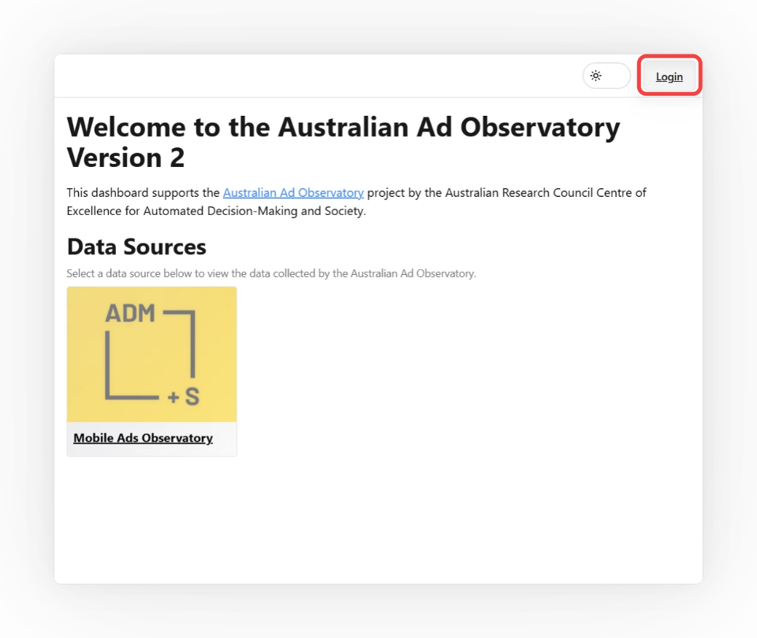

---

Enter your email and password to log in. If you have forgotten your password, contact the Australian Ad Observatory team to reset it.


---


After logging in, you can edit your user information, including display name and password in the "Edit Profile" page, accessible by clicking on the "Edit" icon at the bottom right of the sidebar.

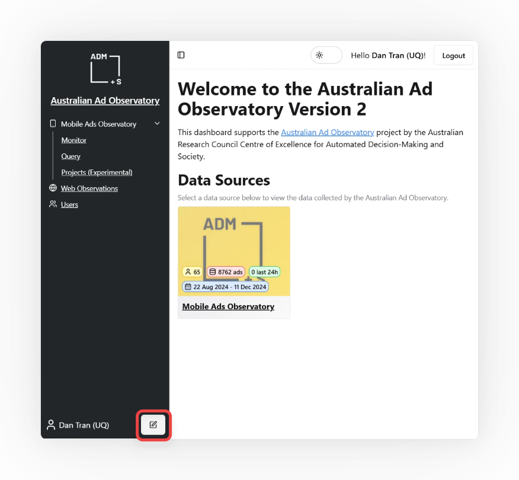

---


After updating your information, click the "Save Changes" button to confirm.

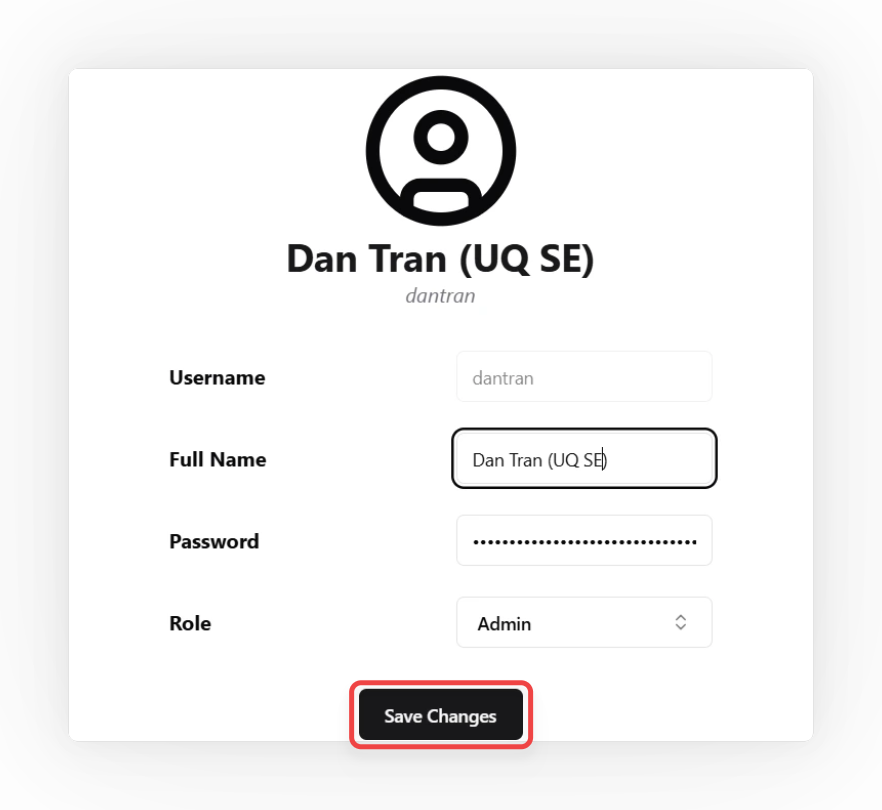

### Viewing Ads

---

After logging in, on the landing page, click on the "Mobile Ads Observatory" data source, or the "Monitor" tab under "Mobile Ads Observatory" to access the monitoring page.

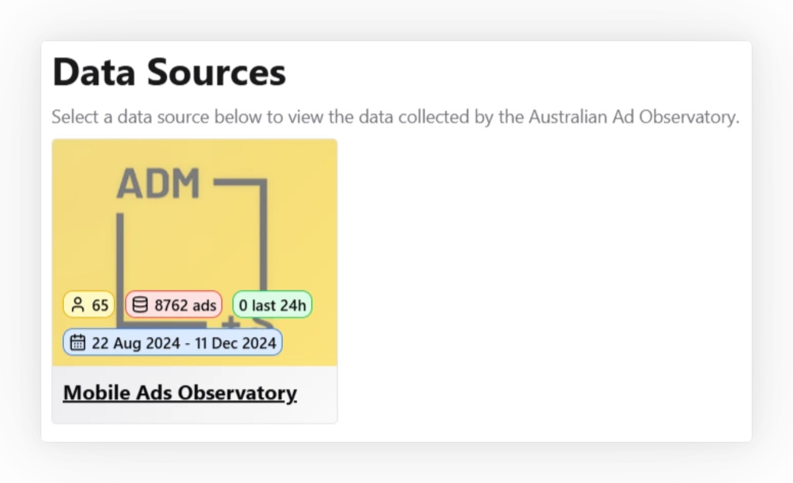

---

The monitoring page displays all the ads that have been collected by the Australian Ad Observatory and can be used to monitor the system's health and performance. 

By default, the page shows all-time ads collected, but you can optionally filter the ads by a date range using the date filter at the bottom of the page.

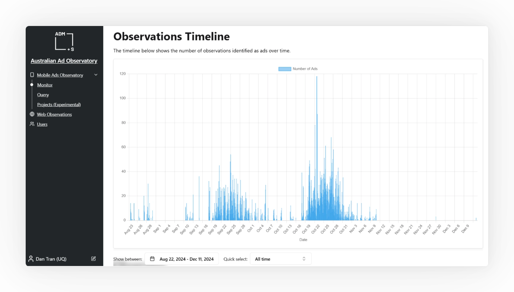

---

An observer identifies a device with the unique activation code provided by the Australian Mobile Ad Toolkit. The table displays the daily count of ads collected by each observer.

Click on the observer ID to view the ads collected by that observer.

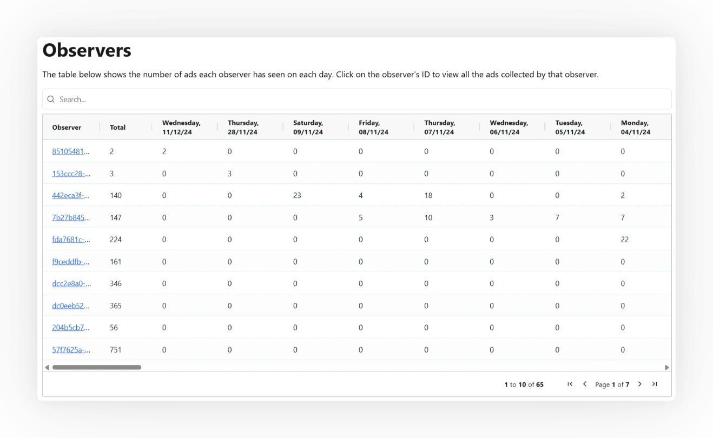

---

The ads browser displays a gallery of ads collected. You can group the ads by date, week or month, and sort them by date.

Additionally, if you know the ID of the ad you are looking for, you can search for it using the search bar.

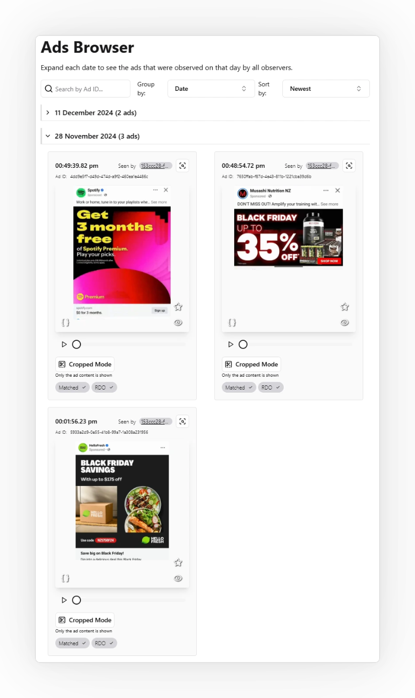

---

Each card in the ads browser shows basic information about the ad, including the ad ID, the time it was collected, the observer ID, and the ad's image. For more details about the ad, click on the expand button on the top right corner of the card to open the "Rich Ad Data View".

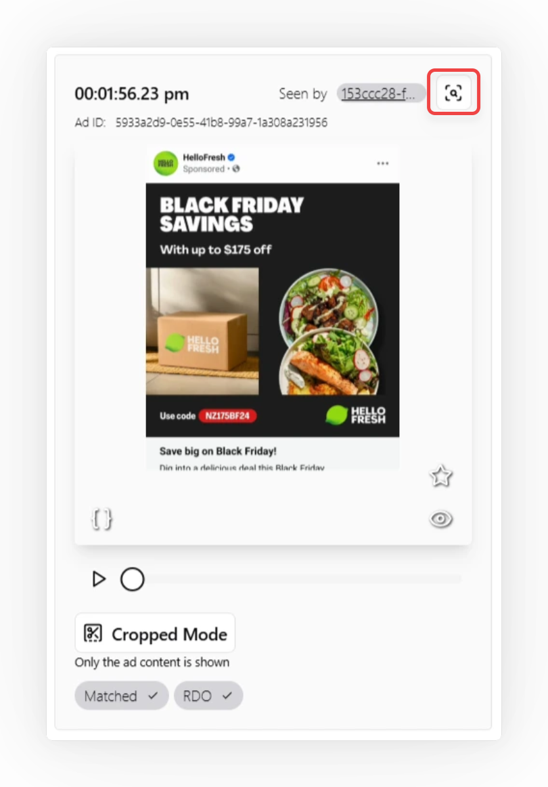

---

By default, the "Rich Ad Data View" displays the Optical Character Recognition (OCR) data extracted from the ad image. This includes the list of text detected in the image and the confidence score of the detection (higher scores indicate higher confidence).

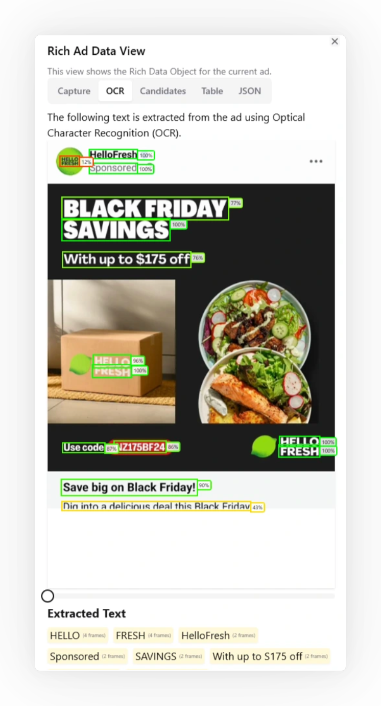

---

The "Candidates" tab displays the list of advertisement postings that are potentially related to the ad, provided by Facebook's Ad Library. The list includes the advertiser's name, the link to the advertiser's page, the start and end date of the ad, the original content of the ad (image, video and text) and more. 

Additionally, some ads may include their marketing statistics, such as the number of impressions and the amount spent on the ad.

**Note**: Not all ads will have candidates. This happens if the ad is not available in Facebook's Ad Library, or if the OCR data extracted from the ad image is not sufficient to identify the advertiser.

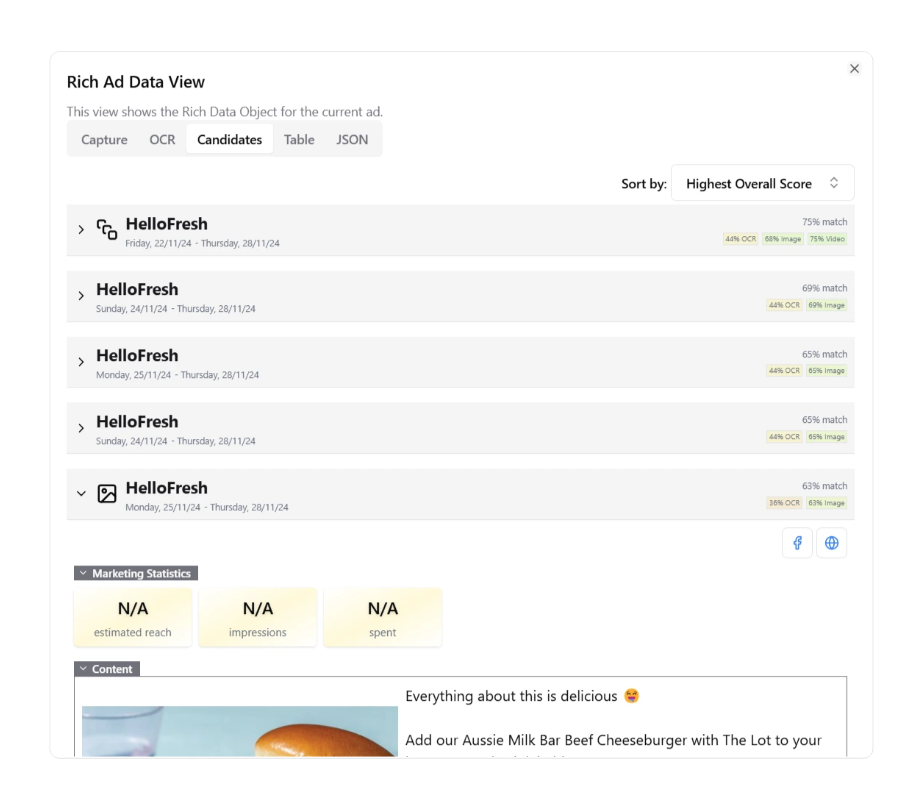

---

The "Table" tab allows you to explore the data collected from the ad in a tabular format.

Due to the large amount of data fields collected for each ad, you will need to select the fields you want to display in the table.

After selecting the fields, you can download the table in CSV format by clicking the "Download CSV" button.

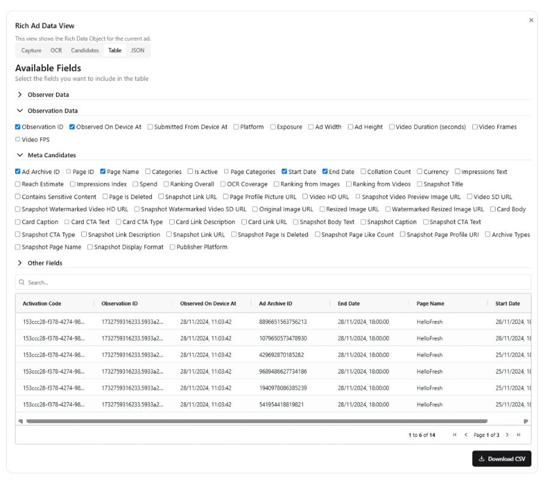

---

The "JSON" tab shows the raw data available for the ad in JSON (JavaScript Object Notation) format. This is intended for advanced users who want to access the raw data directly for further analysis.

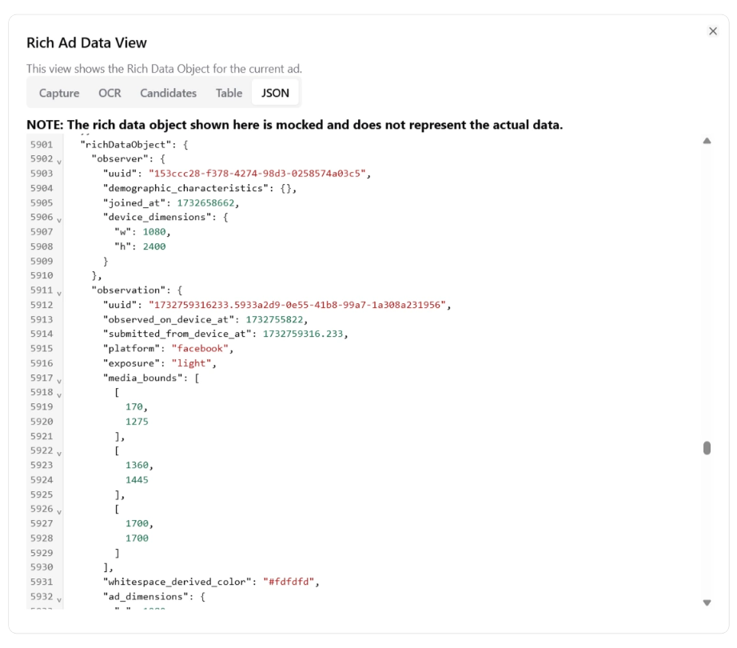

### Querying Ads

---

The query builder allows you to filter the ads based on specific criteria. You can access the query builder by clicking the "Query" tab on the sidebar.


---

The Visual mode of the Query Builder allows you to select a specific "Filter method", which determines how the ads will be filtered. The available filter methods are:

| Filter Method             | Description (returns ads that...)                                                                              | Input Type          |
| ------------------------- | -------------------------------------------------------------------------------------------------------------- | ------------------- |
| `AND`                     | match all the selected criteria.                                                                               | Query builder       |
| `OR`                      | match any of the selected criteria.                                                                            | Query builder       |
| `NOT`                     | do not match the selected criteria.                                                                            | Query builder       |
| `ANYTHING CONTAINS`       | contain **at least one of** the specified strings in **any** of its fields. This is the default filter method. | Text                |
| `TIME AFTER`              | were collected after the specified date and time.                                                              | Date and time input |
| `TIME BEFORE`             | were collected before the specified date and time.                                                             | Date and time input |
| `OBSERVER ID CONTAINS`    | were collected by observers whose ID contains **at least one of** the specified strings.                       | Text                |
| `OBSERVATION ID CONTAINS` | were collected by observers whose observation ID contains **at least one of** the specified strings.           | Text                |
| `CATEGORIES CONTAINS`     | contain **at least one of** the specified strings in the categories field.                                     | Text                |
| `PAGE NAME CONTAINS`      | contain **at least one of** the specified strings in the page name field.                                      | Text                |

You can quickly add `AND` and `OR` filters by hovering over the filter method and click the `+ AND` button on the right or the `+ OR` button at the bottom.

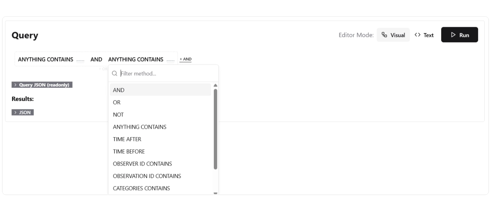

---

Alternatively to the Visual mode, you can use Text mode to write your query directly in the query builder. The query builder will automatically convert valid text query into a visual query.

All the above filter methods can be used in the text query, except that spaces are replaced with underscores. For example, `ANYTHING CONTAINS` becomes `ANYTHING_CONTAINS`. An example of a text query is:

```
ANYTHING_CONTAINS("POLITICAL") AND PAGE_NAME_CONTAINS("Queensland")
```

This is useful for advanced users to quickly write complex queries without having to manually select the filter methods. Additionally, this can be used to share queries with other users.

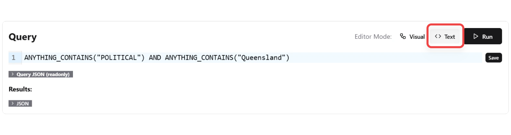

---

After completing your query, click the "Run" button to see the ads that match your criteria. This will display the ads in a similar format to the monitoring page, but only showing the ads that match your query.

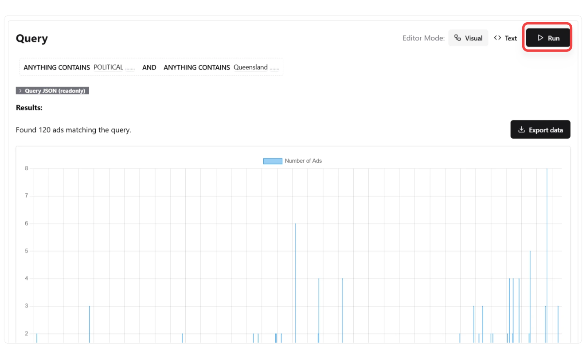

---

You can export the ads that match your query in CSV format by clicking the "Export Data" button on the top right corner of the query results.

This will prompt you to select the fields you want to export in the CSV file. A "Preview" table will show you a sample of the data that will be exported.

Once you have selected the fields, click on the "Export data" button to download the CSV file. This will take a while to generate the file, depending on the number of ads that match your query.

**Note**: You can close the form while the file is being generated, but you will need to keep the tab open until the download is complete. Otherwise, the download will be interrupted.

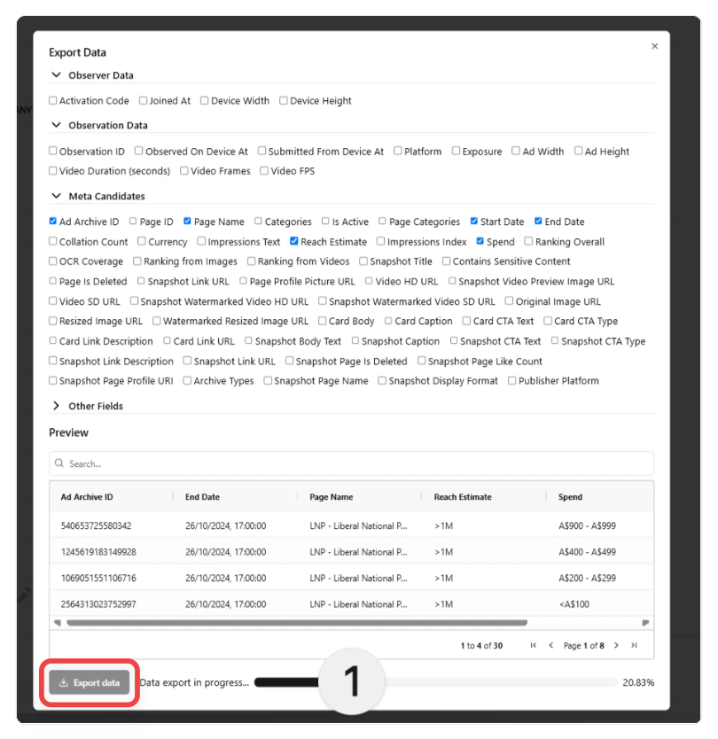

### Projects

---

Projects allow you to save queries and share them with other users. You can access the projects page by clicking the "Projects" tab on the sidebar.

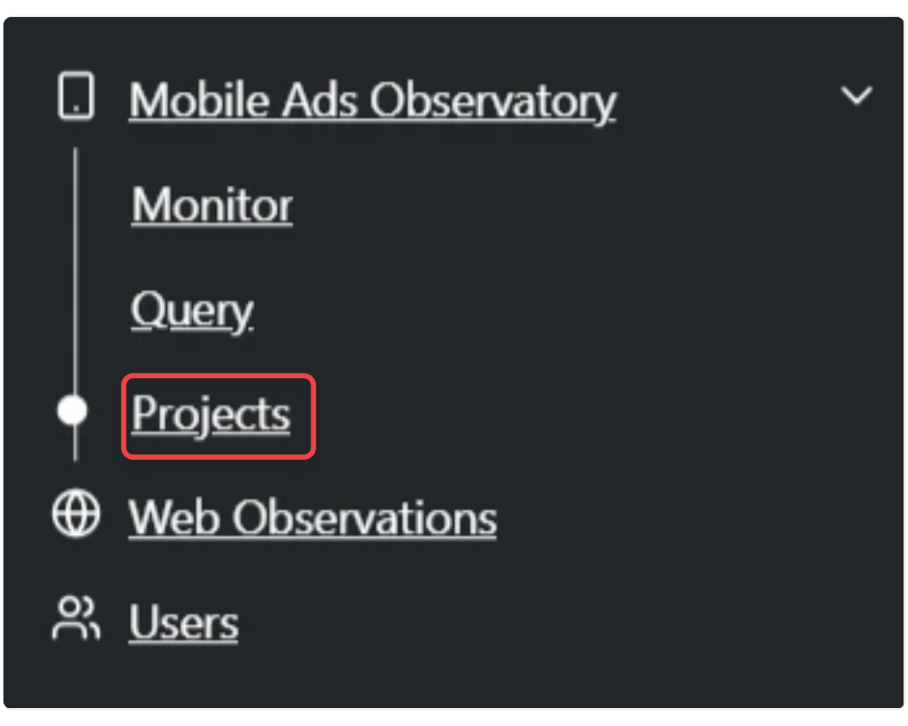

---

The projects page displays all the projects you have created, and those shared with you by other users. You will see the project name, the owner of the project and the number of people the project is shared with.

To create a new project, click the "+ New Project" button on the top right corner of the page. You will be prompted to enter the project name and a description.

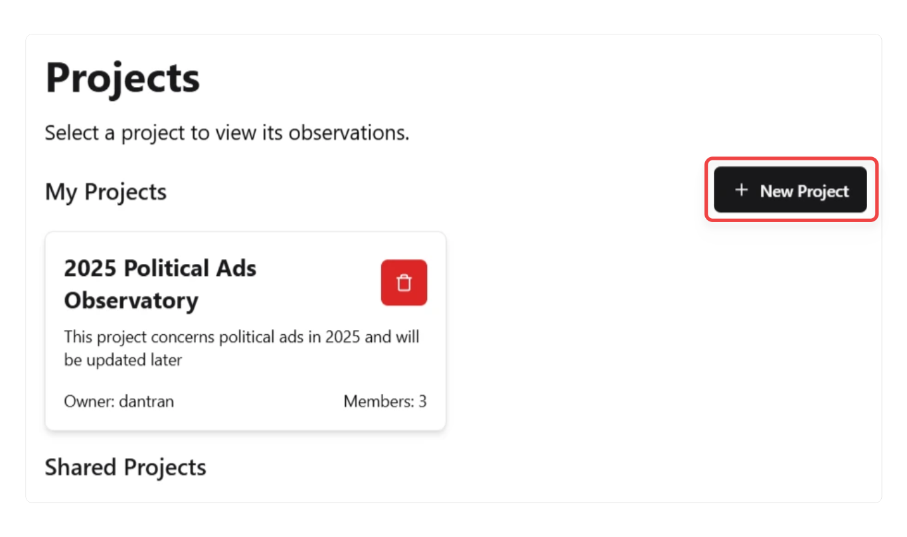

---

On the project page, you can edit the project name and description by clicking on the name or description and entering the new text. Your project will be automatically saved.

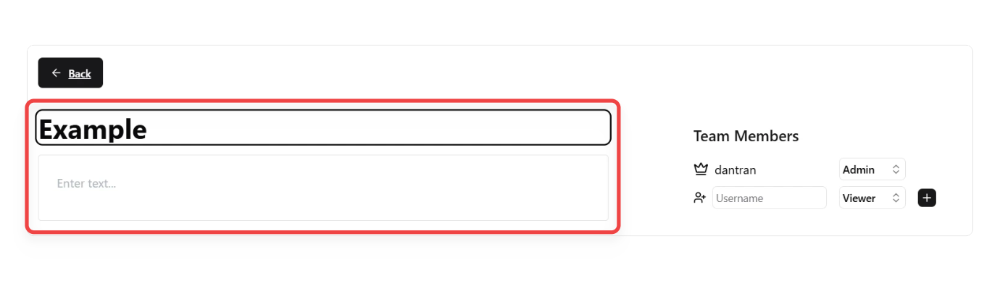

---

You can also modify the access of the project through the "Team Members" section on the top right of the page. You can add other users to the project by entering their username and clicking the "+" button.

You can also modify the access level of the users by clicking on the dropdown menu next to their username. The available access levels are:

| Access Level | Description                                                                                                              |
| ------------ | ------------------------------------------------------------------------------------------------------------------------ |
| `Viewer`     | Can view the project and its queries, but cannot edit them. This is the default access level.                            |
| `Editor`     | Can view and edit the project name, description and its queries, but cannot add or remove users.                         |
| `Admin`      | Have all the permissions of an editor, and can manage users and their access levels. Admins can also delete the project. |


---

The project follows a notebook-like structure, where you can add cells to write notes or queries. You can add a new cell by clicking the "+ Text" or "+ Query" buttons at the bottom of the project page.

Additionally, you can insert a cell above or below an existing cell by clicking the "+ Text" or "+ Query" buttons above or below the cell when hovering over it.

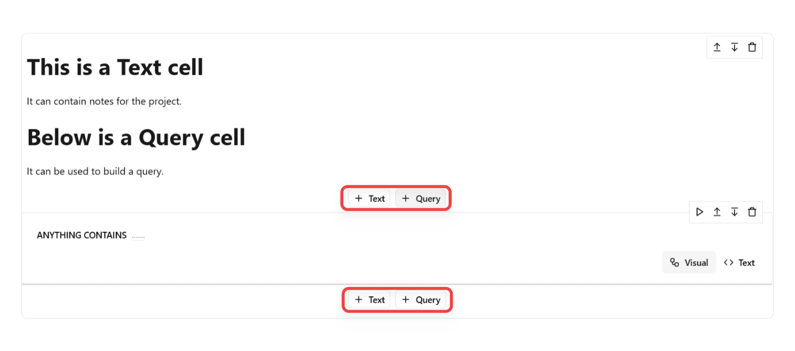

---

You can delete a cell by clicking the "Delete" icon on the top right corner of the cell. 

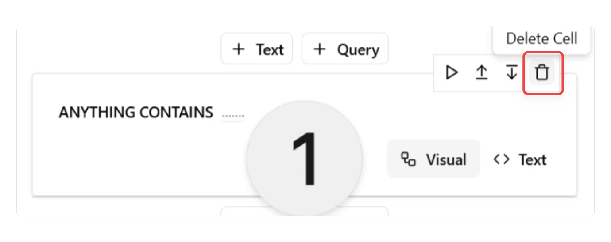

You will need to confirm the deletion by clicking on the "Delete" icon again, or "Cancel" icon to keep the cell.

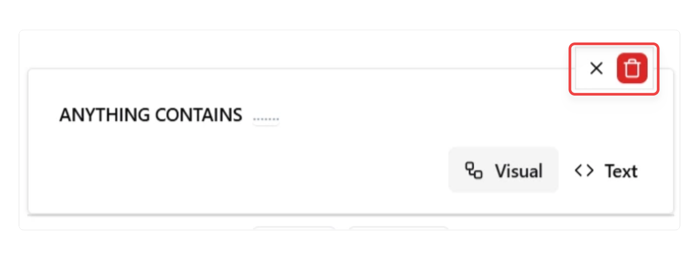

---

You can also move a cell up or down by clicking the "Shift Cell Up" or "Shift Cell Down" icons on the top right corner of the cell.

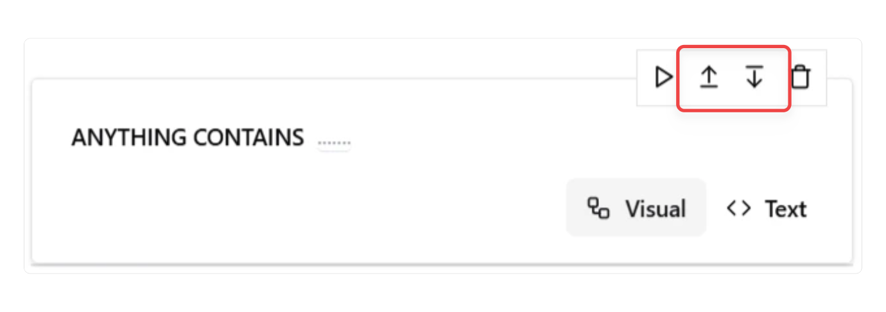

---

The text cell allows you to write notes or instructions for the project. You can format the text using Markdown, a lightweight markup language with plain text formatting syntax. You can learn more about Markdown [here](https://www.markdownguide.org/basic-syntax/).

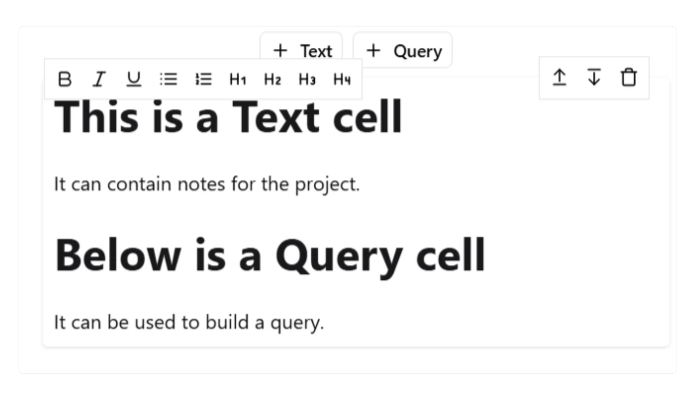

---

The query cell allows you to write a query to filter the ads. Refer to the [Querying Ads](#querying-ads) section for more information on how to write queries.

After writing your query, click the "Run" icon on the top right corner of the cell to see the ads that match your criteria.

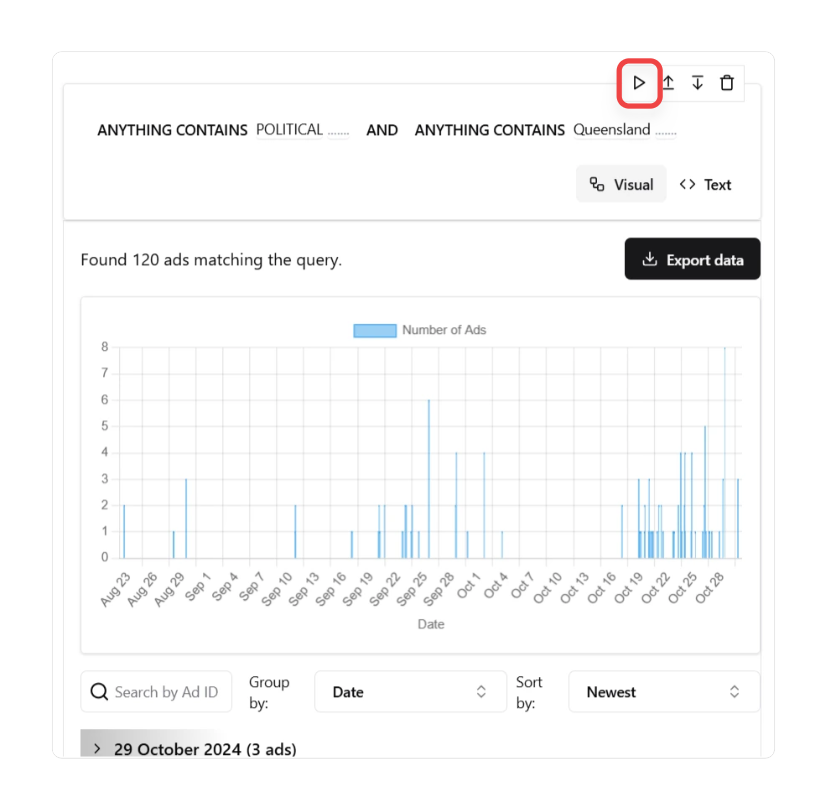