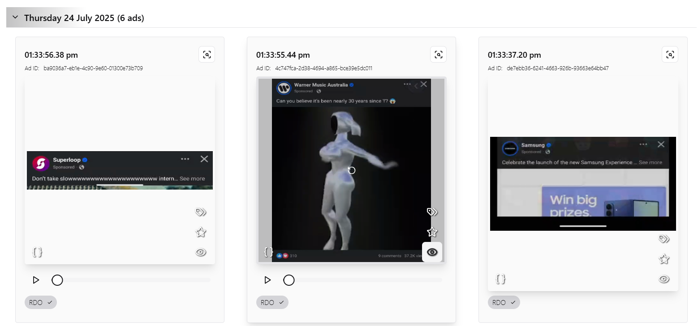
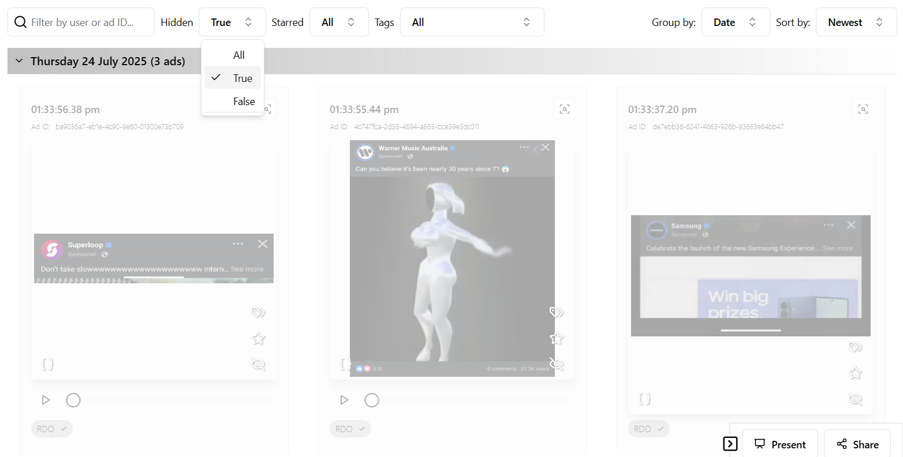
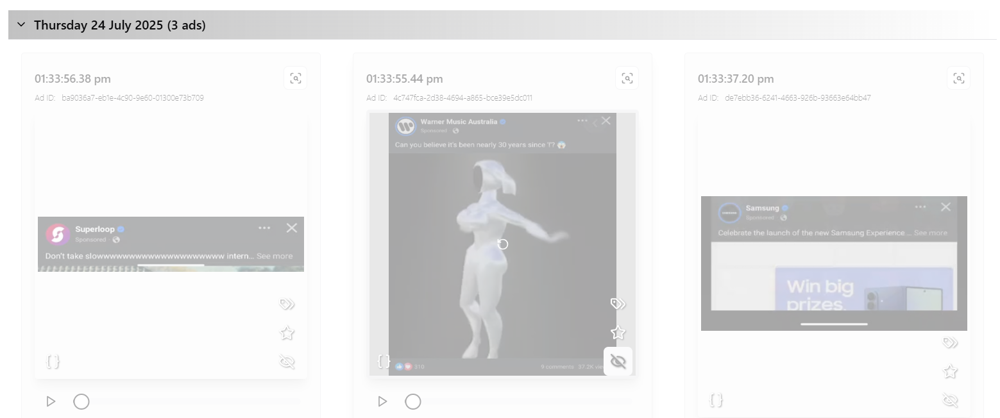
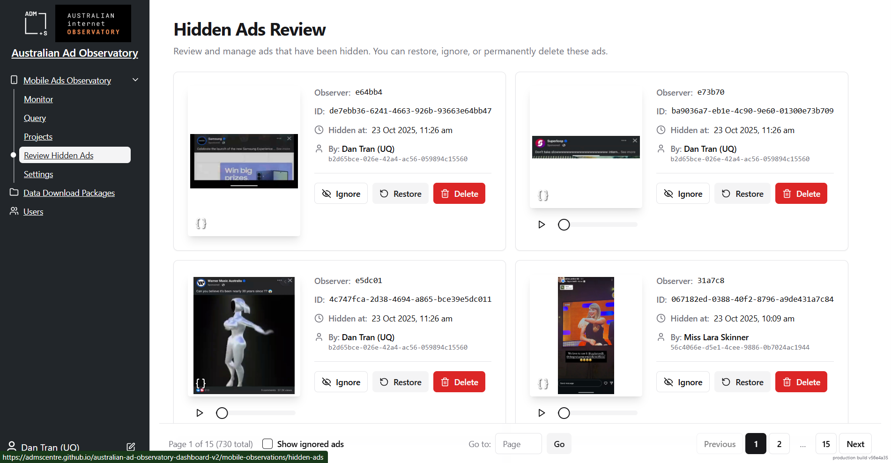
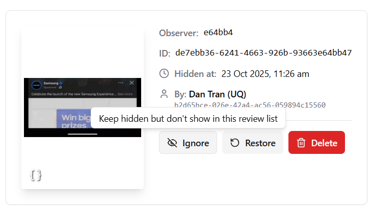
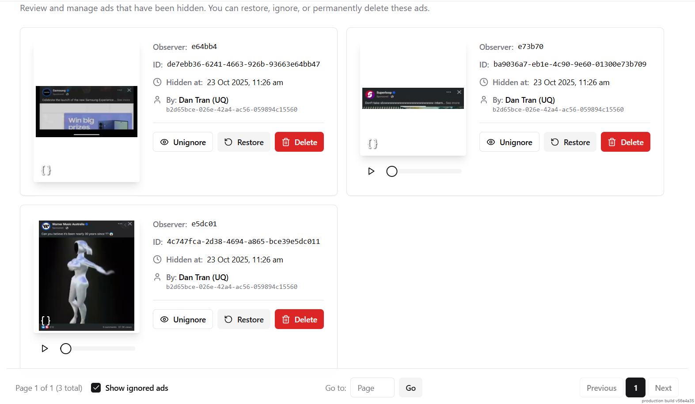
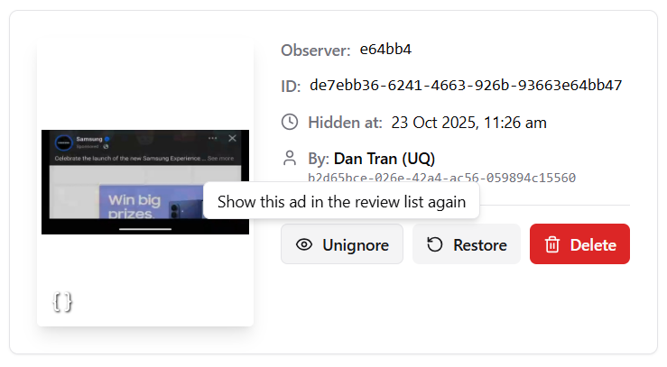
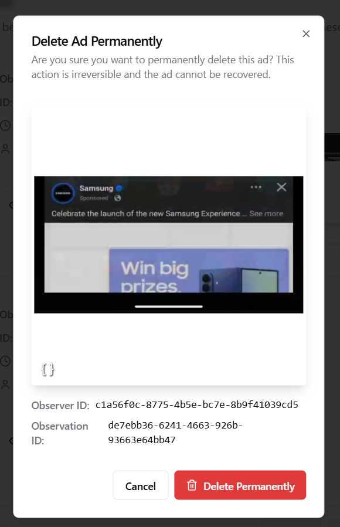

# Removing Unwanted Ads

This guide provides step-by-step instructions on how to hide and permanently delete unwanted ads from the Australian Ad Observatory Dashboard.

## Overview

The Australian Ad Observatory Dashboard provides a two-tier system for managing unwanted ads:

- **All approved users** can hide ads from the dashboard, which applies a filter to separate these ads from the default view
- **Admin users** can permanently delete ads from the system after review

Hidden ads are also removed from the user's mobile app dashboard view, ensuring a consistent experience across platforms.

---

## [All Approved Users] Hiding Ads

### Step 1: Hide an Ad from Your Browser

When viewing ads in the dashboard, you can hide individual ads that you don't want to see.

To hide an ad:
1. Locate the ad you want to hide in your dashboard
2. Click the hide icon button on the ad card
3. The ad will be immediately removed from your default dashboard view

**Note:** Hidden ads will also be hidden from your dashboard view in the mobile app, ensuring consistency across all platforms.

### Step 2: View Your Hidden Ads

You can review all ads you've previously hidden at any time.

To access your hidden ads:
1. Navigate to the hidden ads section in your dashboard
2. Browse through all ads you've marked as hidden
3. Review ads to decide if you want to unhide any of them

### Step 3: Unhide an Ad (Optional)

If you've hidden an ad by mistake or want to see it again, you can easily restore it.

To unhide an ad:
1. Go to your hidden ads view
2. Find the ad you want to restore
3. Click the unhide button
4. The ad will be restored to your default dashboard view and mobile app

**Note:** Admin users can review hidden ads and permanently delete them if needed through a separate administrative process.

---

## [Admin Users Only] Permanently Deleting Ads

### Accessing the Admin Hidden Ads View

Admin users have access to a centralized view of all hidden ads across the system:

**URL:** [https://admscentre.github.io/australian-ad-observatory-dashboard-v2/mobile-observations/hidden-ads](https://admscentre.github.io/australian-ad-observatory-dashboard-v2/mobile-observations/hidden-ads)

### Step 1: Review Hidden Ads

As an admin, you can view all ads that have been hidden by users across the platform.

From this view, you have three available actions:

1. **Ignore:** Keep the ad hidden and move it to a separate ignored list for later review
2. **Restore:** Unhide the ad and return it to the default dashboard view (same effect as user unhide)
3. **Delete:** Permanently delete the ad from the system (irreversible action)

### Step 2: Ignore Ads (Optional)

If you want to keep an ad hidden but defer the decision on permanent deletion, you can ignore it.

When you ignore a hidden ad:
- The ad remains hidden from user views
- It's moved to a separate "ignored" list for admin review
- You can review and take further action on it later

### Step 3: View Ignored Ads

Access the list of ads you've marked as ignored for later review.

To view ignored ads:
1. Click the **"Show ignored ads"** button in the admin interface
2. Browse through all ads that have been marked as ignored
3. Decide whether to unignore, restore, or delete each ad

### Step 4: Unignore an Ad (Optional)

You can move an ad back from the ignored list to the hidden ads list.

To unignore an ad:
1. Navigate to the ignored ads view
2. Find the ad you want to restore to the hidden ads list
3. Click the unignore button
4. The ad will return to the hidden ads list for further review

### Step 5: Permanently Delete an Ad

When you're certain an ad should be removed from the system, you can permanently delete it.

To permanently delete an ad:
1. Locate the ad in either the hidden ads or ignored ads view
2. Click the **delete** button
3. A confirmation prompt will appear
4. Confirm the deletion

**⚠️ Warning:** This action is **irreversible**. Once deleted, the ad cannot be recovered from the system.

---

## Workflow Summary

### For All Users
1. Hide unwanted ads from your dashboard
2. Review hidden ads at any time
3. Unhide ads if needed

### For Admin Users
1. Review all hidden ads system-wide
2. Ignore ads for later review (optional)
3. Restore ads to user views (optional)
4. Permanently delete ads after careful review

---

## Best Practices

- **Regular Users:** Hide ads that are irrelevant, offensive, or contain errors. You can always unhide them later if needed.
- **Admin Users:** Review hidden ads regularly and make decisions on permanent deletion. Use the ignore feature to defer decisions on borderline cases.
- **Communication:** If you notice patterns in hidden ads (e.g., specific advertisers, ad types), consider discussing with your team to improve ad quality filtering.

---

## Need Help?

If you encounter any issues with hiding or deleting ads, please contact the system administrator or refer to the main [User Guide](../README.md) for additional support resources.