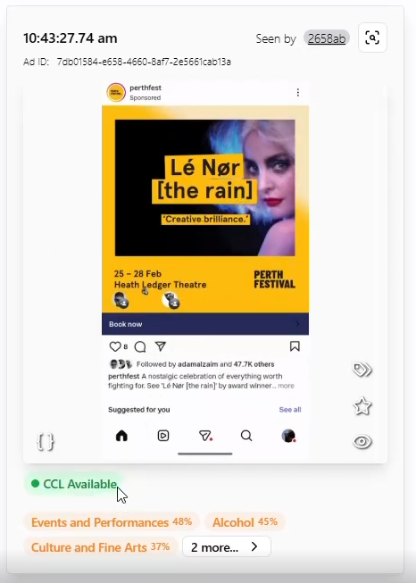
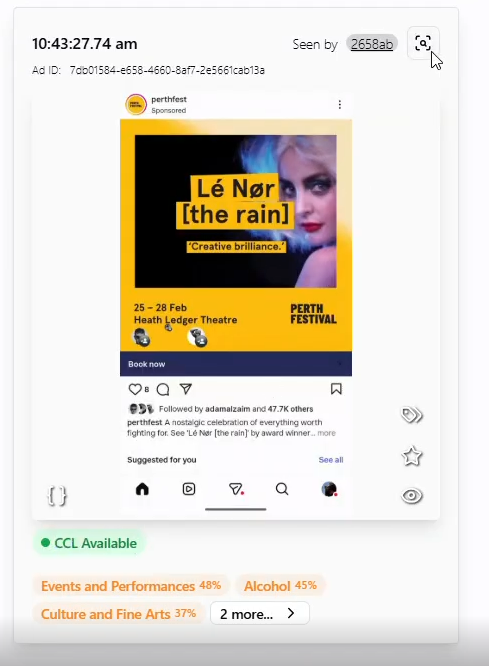
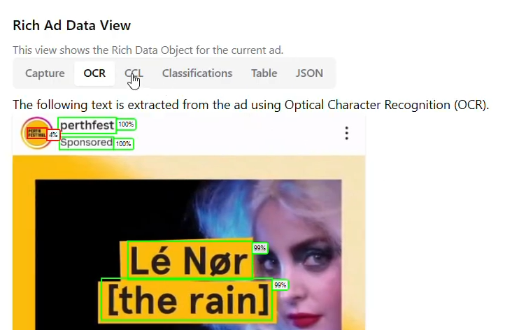
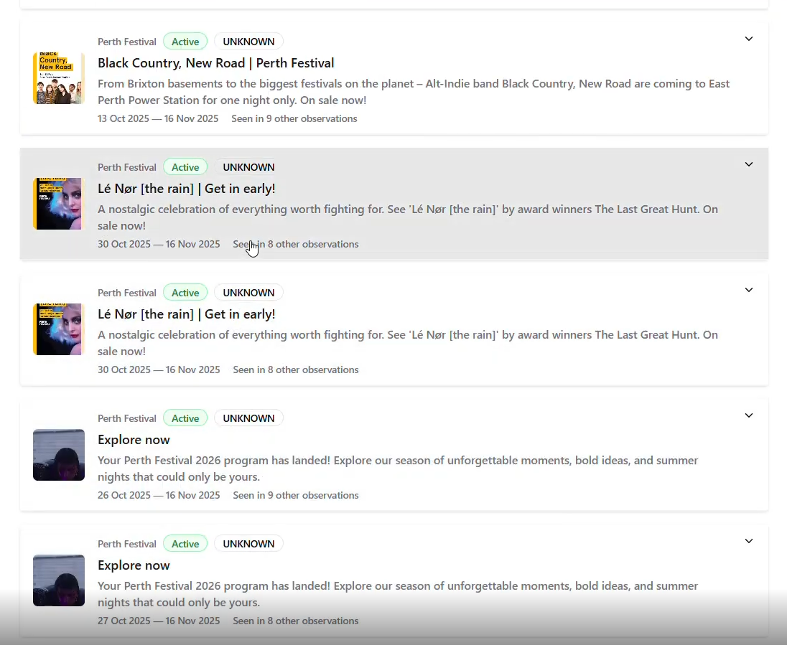
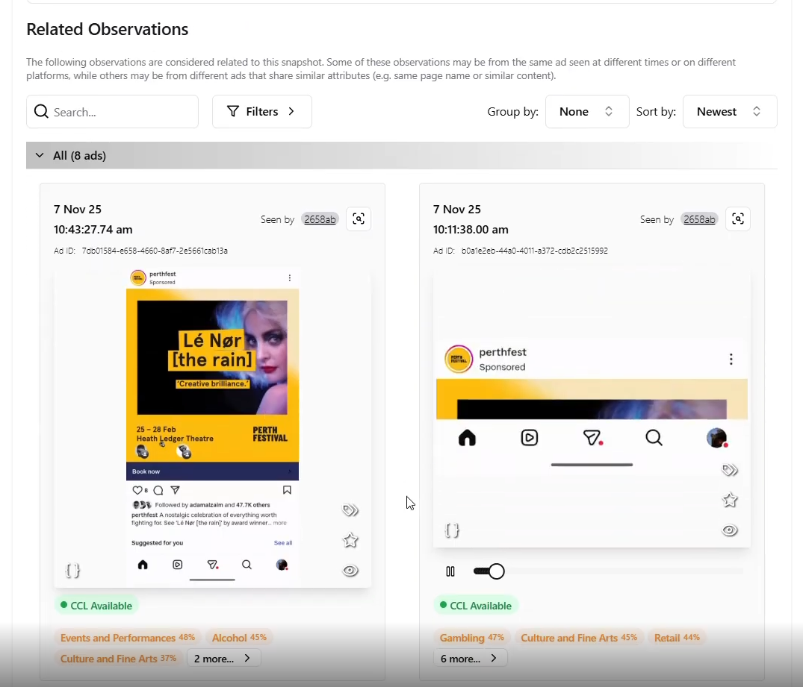
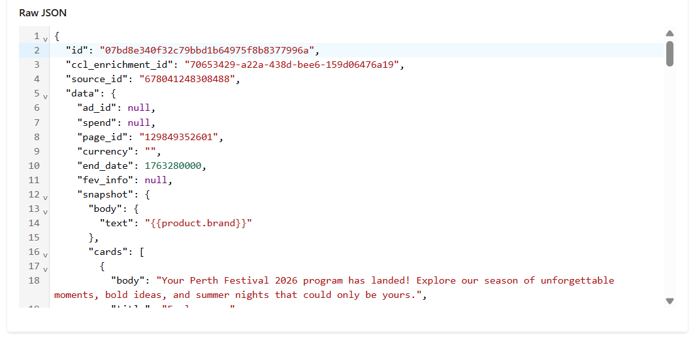
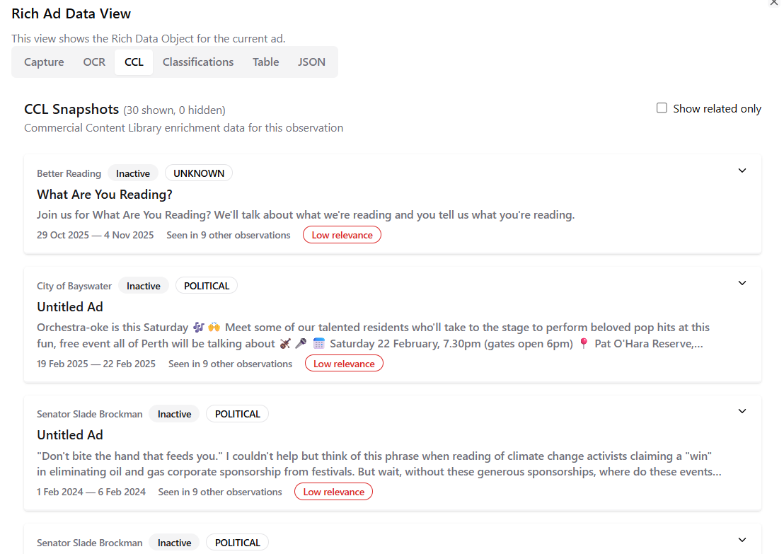
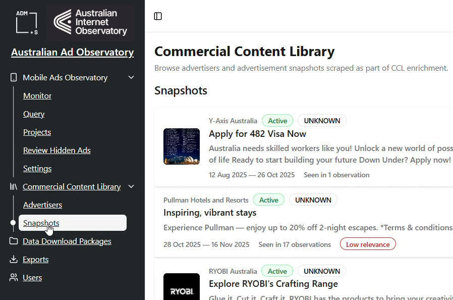

# Viewing CCL Enrichments in the Australian Ad Observatory Dashboard

Created on 17/02/2026

Updated on 17/02/2026

Demo videos:
* [Viewing CCL Enrichments in the Rich View](https://drive.google.com/file/d/1BjMuxG0P6d5VyX2Qkco2yJkIL8T63yia/view?usp=drive_link)
* [Browsing the "Snapshots" Page](https://drive.google.com/file/d/12x6NNK48FIJu0-GHKPEt08KjAsSdv7_I/view?usp=drive_link)

---

## CCL Enrichment in the Ad Rich View

The Commercial Content Library (CCL) enrichment provides additional context and information about ads in the Australian Ad Observatory Dashboard. This guide will help you understand how to identify ads with CCL enrichment, navigate the rich view of ad **snapshots**, and explore the detailed data associated with these ads.

### What is CCL Enrichment?

CCL enrichment is a feature that enhances the information available for certain ads by "querying" the observed ad data against the Commercial Content Library provided by the social media platforms. 

The major form of CCL enrichment is the "snapshot", which is an instance of an advertisement captured at a specific point in time from the Commercial Content Library. Each snapshot contains detailed information about the ad, such as its creative content, advertiser details, and performance metrics. This enrichment allows users to gain deeper insights into the ads they are observing in the dashboard.

**Important Notes**:
* CCL enrichment is only available for a subset of ads in the dashboard, and not all ads will have this enrichment. Currently, **only ads observed from Facebook and Instagram have CCL enrichment**.
* The matching process for CCL enrichment is not perfect, and there will be cases where a Facebook or Instagram ad does not have CCL enrichment due to various reasons such as low OCR quality, errors in the matching process, or the Commercial Content Library not providing data for that ad.

### Identifying CCL Enriched Ads

When browsing ads in the dashboard, you can identify those with CCL enrichment by looking for a "CCL Available" badge that signifies the presence of enriched data.

### Using the Rich View

Ads with this badge have additional information that can be accessed through the **CCL** tab of the rich view. To access the rich view, click on the "Expand" button on the top-right corner of the ad card.

In the rich view, you will see a "CCL" tab that contains the enriched data.

### Exploring the CCL Data

Within the CCL tab, you will see various cards that provide further details about the ad, such as:

- A preview image of the ad creative
- The advertiser's name, and whether they are active
- The ad's category
- The body text of the ad
- The starting and ending dates of the ad
- The number of observations of the ad in the dataset

Clicking on any of these cards will expand it to show more detailed information, such as the full creative content, performance metrics and additional advertiser information.

The **Related Observations** section at the bottom of the expanded card will show you other ads that are related to the one you are viewing, allowing you to explore observations of this ad across different time periods.

Finally, the **Raw JSON** tab will show you the raw data of the snapshot in JSON format, which can be useful for users who want to see the underlying data structure or perform their own analysis.

#### Low Confidence Matches

Due to the fuzzy nature of the matching process for CCL enrichment, some snapshots may not be truly relevant to the observation you are viewing. By default, the low confidence matches are hidden, but you can choose to show them by unchecking the **Show related only** checkbox in the CCL tab. 

If you choose to show them, these snapshots will be marked with a **Low relevance** badge.

---

## Experimental: The "Snapshots" Page

Besides viewing CCL enrichments on individual ads, there is also an experimental "Snapshots" page that allows you to browse all the snapshots of ads with CCL enrichment in one place. This page is still in development, and we welcome your feedback to improve it.

To access the "Snapshots" page, click on the "Snapshots" tab in the main navigation bar of the dashboard.

On the "Snapshots" page, you can scroll through the list of snapshots, which will be displayed in a similar format to the CCL tab in the rich view. As you scroll, more snapshots will automatically load, allowing you to explore a wide range of ads with CCL enrichment.

---

## Future Features and Feedback

The "Snapshots" page currently has limited functionality, and you cannot yet filter or search for specific snapshots. Your feedback on what features you would like to see in this page would be greatly appreciated as we continue to develop it. Considerations for future features include:

* As a researcher, I want to filter snapshots by various criteria (e.g., date range, advertiser, ad category, or by specific keywords in the snapshot's advertiser name, title or body text) so that I can find relevant snapshots more easily.
* As a researcher, I want to sort snapshots by different metrics (e.g., number of observations, date of the snapshot) so that I can prioritise which snapshots to explore.

Additionally, the CCL data in the rich view is not exportable or queryable at this stage, but we are considering adding features that would allow users to export this data for further analysis. If you can share your thoughts on what data points would be most useful to export, and in what format, that would be very helpful for us to prioritise this feature.